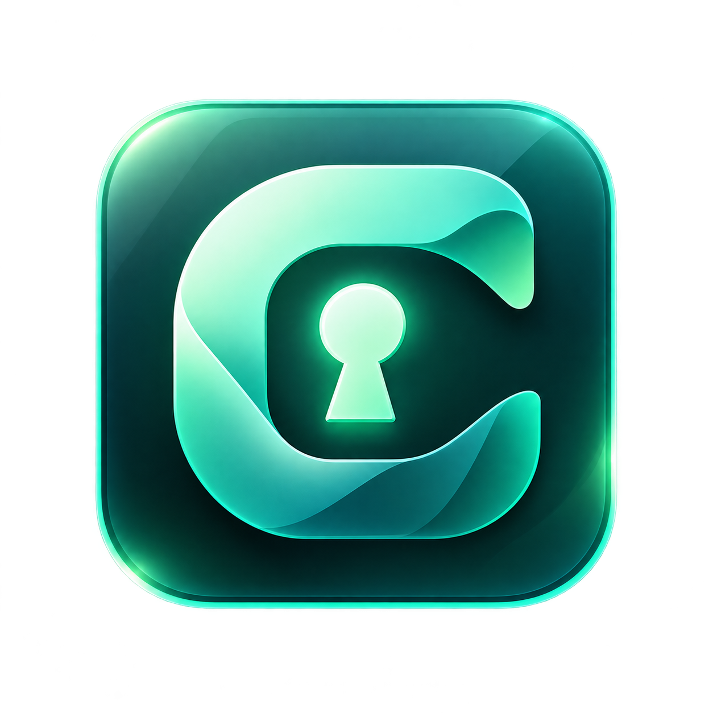

<div align="center">
  
  <h1>ClovaKey</h1>
  <p><strong>A secure, offline-first desktop authenticator for macOS and Windows.</strong><br/>
  Part of the Clova suite.</p>
</div>

---

ClovaKey generates TOTP and HOTP authentication codes, imports your accounts from
Google Authenticator, and keeps every OTP secret **encrypted on your device**. It
requires no account, no cloud, and no internet connection — a fresh install with the
network disconnected can add an account and generate codes.

## Features

- **Standards-compliant OTP** — RFC 4226 (HOTP) and RFC 6238 (TOTP); SHA-1/256/512,
  6–8 digits, configurable periods. Verified against the published RFC test vectors.
- **Google Authenticator import** — decodes `otpauth-migration://` export QR codes
  locally (protobuf implemented in-project), including exports split across several QR
  codes, with an import preview, duplicate detection, and per-account editing.
- **Add accounts any way** — camera scan, QR image, pasted `otpauth://` link, or manual
  setup key.
- **Encrypted vault** — each secret is sealed with XChaCha20-Poly1305; the master key is
  protected by the OS keychain, with an optional Argon2id passphrase for a hard lock.
- **Portable encrypted backups** — a versioned, passphrase-protected `.clovakey` file you
  can restore on any machine.
- **Polished desktop UX** — live countdown rings, one-click copy with a race-safe
  clipboard auto-clear, favorites, groups, instant search, a menu-bar/tray presence,
  light/dark themes, and full keyboard support.
- **Private by design** — no telemetry, no analytics, no network calls for authenticator
  data. QR codes and secrets never leave the device.

## Technology

| Layer | Choice |
|---|---|
| Shell | [Tauri 2](https://tauri.app) |
| Security & OTP core | Rust (`clovakey-core`) |
| Frontend | React 19 + TypeScript + Vite |
| Crypto | RustCrypto `hmac`/`sha1`/`sha2`, `chacha20poly1305`, `argon2` |
| Storage | SQLite (`rusqlite`, bundled) |
| OS key store | `keyring` (macOS Keychain / Windows Credential Manager) |

See [`docs/ARCHITECTURE.md`](docs/ARCHITECTURE.md) for the full design and
[`docs/SECURITY.md`](docs/SECURITY.md) for the security model.

## Project layout

```
clovakey/
├── src/                     React + TypeScript frontend
│   ├── components/          UI components & dialogs
│   ├── views/               Top-level screens
│   ├── state/               Zustand store
│   ├── lib/                 Typed IPC layer, helpers
│   └── styles/              Design tokens + component CSS
└── src-tauri/               Tauri app + Rust workspace
    ├── core/                clovakey-core — OTP, crypto, vault, import, backup
    │   └── src/{otp,crypto,storage,import,backup,keystore}
    └── src/                 Tauri app: commands, state, tray, clipboard
```

The security-critical logic lives entirely in `clovakey-core`, a pure-Rust library with
**no Tauri or UI dependency**, so it can be exhaustively unit-tested in isolation.

## Development

Prerequisites: [Rust](https://rustup.rs) (stable), Node.js ≥ 20, and the Tauri platform
prerequisites (Xcode Command Line Tools on macOS; the WebView2 runtime + Visual Studio
Build Tools on Windows).

```bash
npm install          # install frontend + Tauri CLI
npm run tauri:dev    # run the app with hot reload
```

Other useful scripts:

```bash
npm run build            # typecheck + build the frontend
npm run lint             # ESLint
npm run typecheck        # tsc --noEmit
cargo test               # run the Rust test suite (from src-tauri/)
cargo clippy --all-targets -- -D warnings
cargo fmt
```

## Building releases

```bash
npm run tauri:build
```

- **macOS** produces `ClovaKey.app` and a `.dmg` (build on Apple Silicon; add the
  `x86_64-apple-darwin` target or a universal build for Intel).
- **Windows** produces an NSIS installer (`.exe`).

Signing/notarization credentials are **not** included. See
[`docs/RELEASE.md`](docs/RELEASE.md) for the exact secrets required and how the CI
release workflow consumes them.

## Security in brief

- OTP secrets are never stored in plaintext and never logged.
- The frontend asks the Rust core to *generate a code for an account id*; it never
  receives the underlying secret during normal use.
- Backups use Argon2id + XChaCha20-Poly1305 and are authenticated.
- ClovaKey functions completely offline and sends no telemetry.

Full details, including the threat model and a self-review checklist, are in
[`docs/SECURITY.md`](docs/SECURITY.md).

## License

MIT — see [`LICENSE`](LICENSE).
